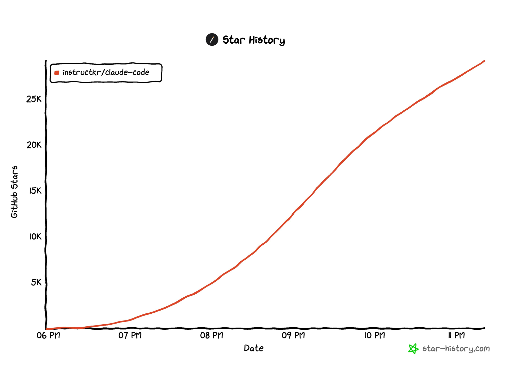

# Baba Code - AI Agent Harness

<p align="center">
  
</p>

<p align="center">
  <strong>Better Harness Tools for Local AI - Jan AI, Ollama, LM Studio</strong>
</p>

<p align="center">
  <a href="https://github.com/sponsors/instructkr"></a>
</p>

> [!IMPORTANT]
> **Rust port is now in progress** on the [`dev/rust`](https://github.com/instructkr/claw-code/tree/dev/rust) branch and is expected to be merged into main today. The Rust implementation aims to deliver a faster, memory-safe harness runtime. Stay tuned — this will be the definitive version of the project.

> If you find this work useful, consider [sponsoring @instructkr on GitHub](https://github.com/sponsors/instructkr) to support continued open-source harness engineering research.

---

## Backstory

At 4 AM on March 31, 2026, I woke up to my phone blowing up with notifications. The Claude Code source had been exposed, and the entire dev community was in a frenzy. My girlfriend in Korea was genuinely worried I might face legal action from Anthropic just for having the code on my machine — so I did what any engineer would do under pressure: I sat down, ported the core features to Python from scratch, and pushed it before the sun came up.

The whole thing was orchestrated end-to-end using [oh-my-codex (OmX)](https://github.com/Yeachan-Heo/oh-my-codex) by [@bellman_ych](https://x.com/bellman_ych) — a workflow layer built on top of OpenAI's Codex ([@OpenAIDevs](https://x.com/OpenAIDevs)). I used `$team` mode for parallel code review and `$ralph` mode for persistent execution loops with architect-level verification. The entire porting session — from reading the original harness structure to producing a working Python tree with tests — was driven through OmX orchestration.

The result is a clean-room Python rewrite that captures the architectural patterns of Claude Code's agent harness without copying any proprietary source. I'm now actively collaborating with [@bellman_ych](https://x.com/bellman_ych) — the creator of OmX himself — to push this further. The basic Python foundation is already in place and functional, but we're just getting started. **Stay tuned — a much more capable version is on the way.**

https://github.com/instructkr/claw-code


## The Creators Featured in Wall Street Journal For Avid Claude Code Fans

I've been deeply interested in **harness engineering** — studying how agent systems wire tools, orchestrate tasks, and manage runtime context. This isn't a sudden thing. The Wall Street Journal featured my work earlier this month, documenting how I've been one of the most active power users exploring these systems:

> AI startup worker Sigrid Jin, who attended the Seoul dinner, single-handedly used 25 billion of Claude Code tokens last year. At the time, usage limits were looser, allowing early enthusiasts to reach tens of billions of tokens at a very low cost.
>
> Despite his countless hours with Claude Code, Jin isn't faithful to any one AI lab. The tools available have different strengths and weaknesses, he said. Codex is better at reasoning, while Claude Code generates cleaner, more shareable code.
>
> Jin flew to San Francisco in February for Claude Code's first birthday party, where attendees waited in line to compare notes with Cherny. The crowd included a practicing cardiologist from Belgium who had built an app to help patients navigate care, and a California lawyer who made a tool for automating building permit approvals using Claude Code.
>
> "It was basically like a sharing party," Jin said. "There were lawyers, there were doctors, there were dentists. They did not have software engineering backgrounds."
>
> — *The Wall Street Journal*, March 21, 2026, [*"The Trillion Dollar Race to Automate Our Entire Lives"*](https://lnkd.in/gs9td3qd)


---

## Porting Status

The main source tree is now Python-first.

- `src/` contains the active Python porting workspace
- `tests/` verifies the current Python workspace
- the exposed snapshot is no longer part of the tracked repository state

The current Python workspace is not yet a complete one-to-one replacement for the original system, but the primary implementation surface is now Python.

## Why this rewrite exists

I originally studied the exposed codebase to understand its harness, tool wiring, and agent workflow. After spending more time with the legal and ethical questions—and after reading the essay linked below—I did not want the exposed snapshot itself to remain the main tracked source tree.

This repository now focuses on Python porting work instead.

## Repository Layout

```text
.
├── src/                                # Python porting workspace
│   ├── __init__.py
│   ├── commands.py
│   ├── main.py
│   ├── models.py
│   ├── port_manifest.py
│   ├── query_engine.py
│   ├── task.py
│   └── tools.py
├── tests/                              # Python verification
├── assets/omx/                         # OmX workflow screenshots
├── 2026-03-09-is-legal-the-same-as-legitimate-ai-reimplementation-and-the-erosion-of-copyleft.md
└── README.md
```

## Python Workspace Overview

The new Python `src/` tree currently provides:

- **`port_manifest.py`** — summarizes the current Python workspace structure
- **`models.py`** — dataclasses for subsystems, modules, and backlog state
- **`commands.py`** — Python-side command port metadata
- **`tools.py`** — Python-side tool port metadata
- **`query_engine.py`** — renders a Python porting summary from the active workspace
- **`main.py`** — a CLI entrypoint for manifest and summary output

## Quickstart

### 1. Install Dependencies

```bash
pip install -r requirements.txt
```

### 2. Configure Your AI Provider

Copy the example environment file and customize it:

```bash
cp .env.example .env
```

Edit `.env` to select your preferred AI provider:

```bash
# For Jan AI (default)
BABA_PRIMARY_PROVIDER=jan
JAN_BASE_URL=http://localhost:1337/v1
JAN_MODEL=local-model

# For Ollama
BABA_PRIMARY_PROVIDER=ollama
OLLAMA_BASE_URL=http://localhost:11434/v1
OLLAMA_MODEL=llama3.2

# For LM Studio
BABA_PRIMARY_PROVIDER=lm_studio
LM_STUDIO_BASE_URL=http://localhost:1234/v1
LM_STUDIO_MODEL=local-model
```

### 3. Start Your Local AI Provider

**Jan AI:**
- Download from https://jan.ai/
- Install and start Jan
- Download a model from the Jan model hub
- Jan runs automatically on `http://localhost:1337`

**Ollama:**
- Download from https://ollama.ai/
- Install and run: `ollama run llama3.2`
- Ollama runs on `http://localhost:11434`

**LM Studio:**
- Download from https://lmstudio.ai/
- Install and load a model
- Start the local server on `http://localhost:1234`

### 4. Run Baba Code

Render the Python porting summary:

```bash
python -m src.main summary
```

Print the current Python workspace manifest:

```bash
python -m src.main manifest
```

List the current Python modules:

```bash
python -m src.main subsystems --limit 16
```

Run verification:

```bash
python -m unittest discover -s tests -v
```

Run the parity audit against the local ignored archive (when present):

```bash
python -m src.main parity-audit
```

Inspect mirrored command/tool inventories:

```bash
python -m src.main commands --limit 10
python -m src.main tools --limit 10
```

### 5. Interactive AI Chat (Coming Soon)

```bash
# Start an interactive session with your local AI
python -m src.main chat
```

## Current Parity Checkpoint

The port now mirrors the archived root-entry file surface, top-level subsystem names, and command/tool inventories much more closely than before. However, it is **not yet** a full runtime-equivalent replacement for the original TypeScript system; the Python tree still contains fewer executable runtime slices than the archived source.

---

## AI Provider Support

Baba Code supports multiple local AI providers with automatic fallback:

| Provider | Default URL | Model | Notes |
|----------|-------------|-------|-------|
| **Jan AI** | `localhost:1337` | User-selected | Full-featured local AI platform |
| **Ollama** | `localhost:11434` | llama3.2 | Lightweight, CLI-focused |
| **LM Studio** | `localhost:1234` | User-loaded | Great for model experimentation |
| **OpenAI** | `api.openai.com` | gpt-3.5-turbo | Cloud fallback option |

### Provider Fallback Logic

Baba Code automatically tries providers in this order:
1. Primary provider (configured via `BABA_PRIMARY_PROVIDER`)
2. Jan AI
3. Ollama
4. LM Studio

If your primary provider is unavailable, Baba Code seamlessly falls back to the next available provider.

### Configuration Options

All configuration is done via environment variables or the `.env` file:

| Variable | Description | Default |
|----------|-------------|---------|
| `BABA_PRIMARY_PROVIDER` | Primary provider type | `jan` |
| `BABA_MAX_TOKENS` | Maximum tokens per response | `4096` |
| `BABA_TEMPERATURE` | Sampling temperature | `0.7` |
| `BABA_STREAM` | Enable streaming responses | `true` |
| `BABA_DEBUG` | Enable debug logging | `false` |

Provider-specific settings:
- `JAN_BASE_URL`, `JAN_MODEL`, `JAN_API_KEY`
- `OLLAMA_BASE_URL`, `OLLAMA_MODEL`, `OLLAMA_API_KEY`
- `LM_STUDIO_BASE_URL`, `LM_STUDIO_MODEL`, `LM_STUDIO_API_KEY`


## Built with `oh-my-codex`

The restructuring and documentation work on this repository was AI-assisted and orchestrated with Yeachan Heo's [oh-my-codex (OmX)](https://github.com/Yeachan-Heo/oh-my-codex), layered on top of Codex.

- **`$team` mode:** used for coordinated parallel review and architectural feedback
- **`$ralph` mode:** used for persistent execution, verification, and completion discipline
- **Codex-driven workflow:** used to turn the main `src/` tree into a Python-first porting workspace

### OmX workflow screenshots


*Ralph/team orchestration view while the README and essay context were being reviewed in terminal panes.*


*Split-pane review and verification flow during the final README wording pass.*

## Community

<p align="center">
  <a href="https://instruct.kr/"></a>
</p>

Join the [**instructkr Discord**](https://instruct.kr/) — the best Korean language model community. Come chat about LLMs, harness engineering, agent workflows, and everything in between.

[](https://instruct.kr/)

## Star History

This repository became **the fastest GitHub repo in history to surpass 30K stars**, reaching the milestone in just a few hours after publication.

<a href="https://star-history.com/#instructkr/claw-code&Date">
  <picture>
    <source media="(prefers-color-scheme: dark)" srcset="https://api.star-history.com/svg?repos=instructkr/claw-code&type=Date&theme=dark" />
    <source media="(prefers-color-scheme: light)" srcset="https://api.star-history.com/svg?repos=instructkr/claw-code&type=Date" />
    
  </picture>
</a>



## Ownership / Affiliation Disclaimer

- This repository does **not** claim ownership of the original Claude Code source material.
- This repository is **not affiliated with, endorsed by, or maintained by Anthropic**.
